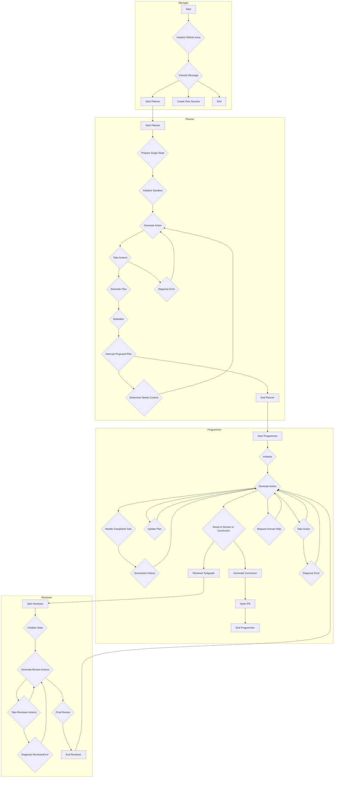

# Open SWE - An Open-Source Asynchronous Coding Agent

Open SWE is an open-source cloud-based asynchronous coding agent built with [LangGraph](https://langchain-ai.github.io/langgraphjs/). It autonomously understands codebases, plans solutions, and executes code changes across entire repositories—from initial planning to opening pull requests.

# Features

- 📝 **Planning**: Open SWE has a dedicated planning step which allows it to deeply understand complex codebases and nuanced tasks. You're also given the ability to accept, edit, or reject the proposed plan before it's executed.
- 🤝 **Human in the loop**: With Open SWE, you can send it messages while it's running (both during the planning and execution steps). This allows for giving real time feedback and instructions without having to interrupt the process.
- 🏃 **Parallel Execution**: You can run as many Open SWE tasks as you want in parallel! Since it runs in a sandbox environment in the cloud, you're not limited by the number of tasks you can run at once.
- 🧑‍💻 **End to end task management**: Open SWE will automatically create GitHub issues for tasks, and create pull requests which will close the issue when implementation is complete.

## Architecture

The following diagram illustrates the overall architecture of the Open SWE agent, which is composed of four main agents: `Manager`, `Planner`, `Programmer`, and `Reviewer`.

**아키텍처 설명:**

*   **Manager (관리자):**
    *   전체 프로세스의 시작점입니다.
    *   GitHub 이슈를 초기화하고, 들어오는 메시지를 분류하여 Planner를 시작할지, 새 세션을 만들지, 또는 종료할지를 결정합니다.

*   **Planner (계획자):**
    *   샌드박스 환경을 설정하고, 사용자의 요구사항을 분석하여 코드 변경을 위한 구체적인 실행 계획을 생성합니다.
    *   계획이 생성되면 사용자에게 제안하고, 승인, 수정 또는 거절을 기다립니다.

*   **Programmer (프로그래머):**
    *   Planner가 생성한 계획에 따라 실제 코드 변경 작업을 수행합니다.
    *   파일 수정, 생성, 삭제 등 다양한 도구를 사용하여 작업을 완료합니다.
    *   작업이 완료되면 Reviewer에게 검토를 요청하거나, 최종 결론을 내리고 PR을 생성합니다.

*   **Reviewer (검토자):**
    *   Programmer가 변경한 코드를 검토합니다.
    *   읽기 전용 도구를 사용하여 변경 사항을 분석하고, 추가 수정이 필요한 경우 새로운 작업 목록을 생성하여 Programmer에게 다시 전달합니다.
    *   최종적으로 변경 사항이 완전하다고 판단되면 작업을 완료합니다.

